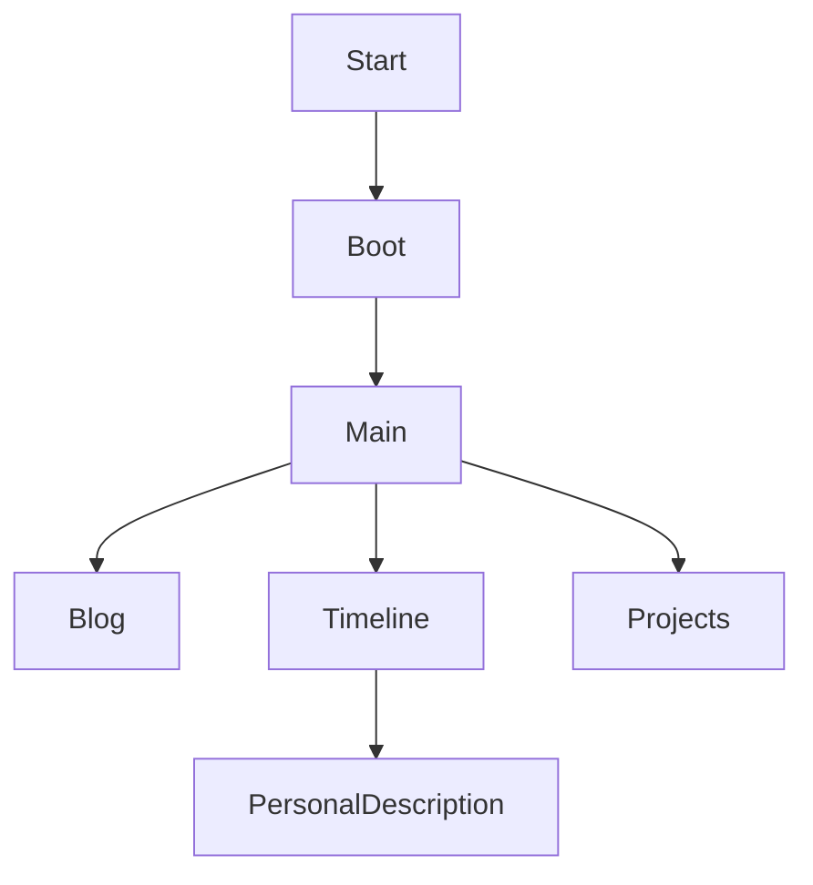
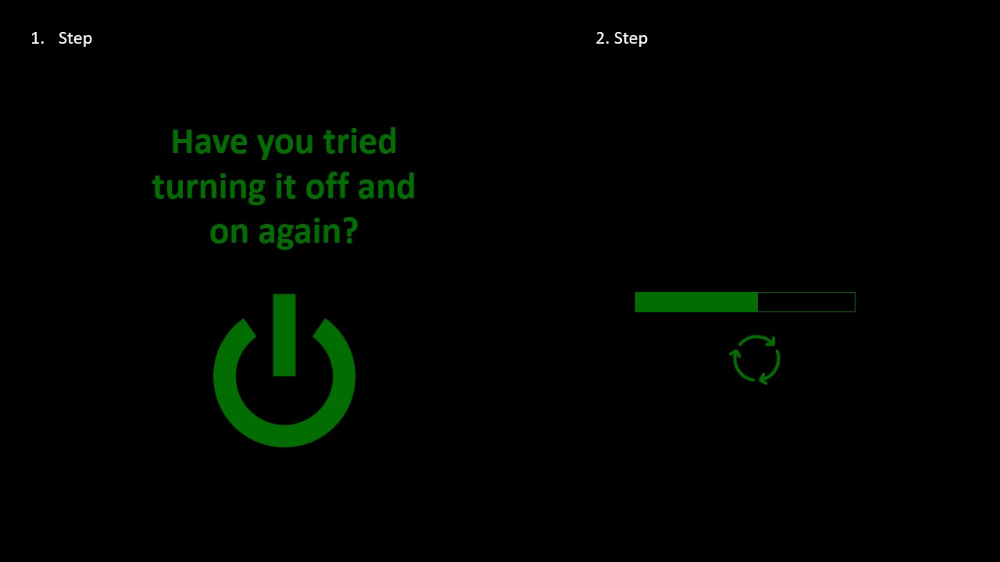
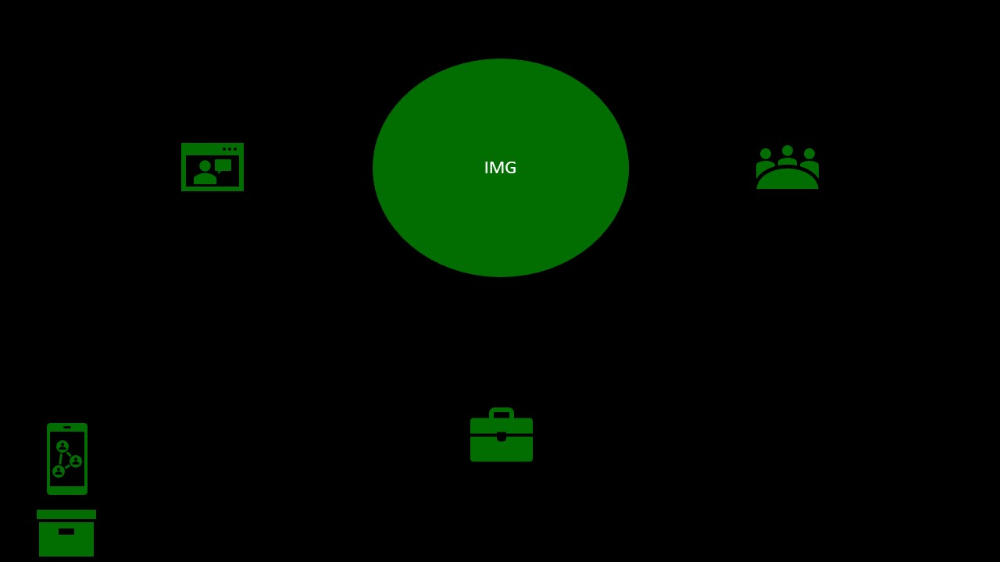
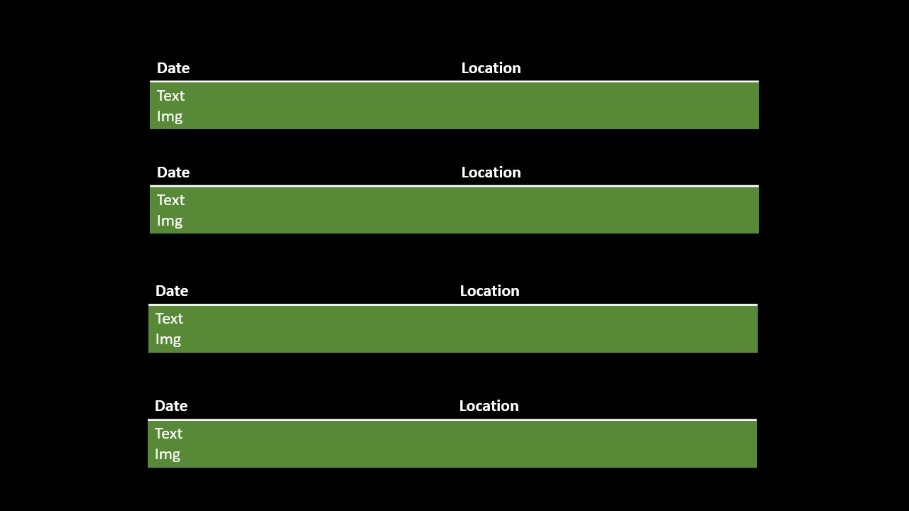
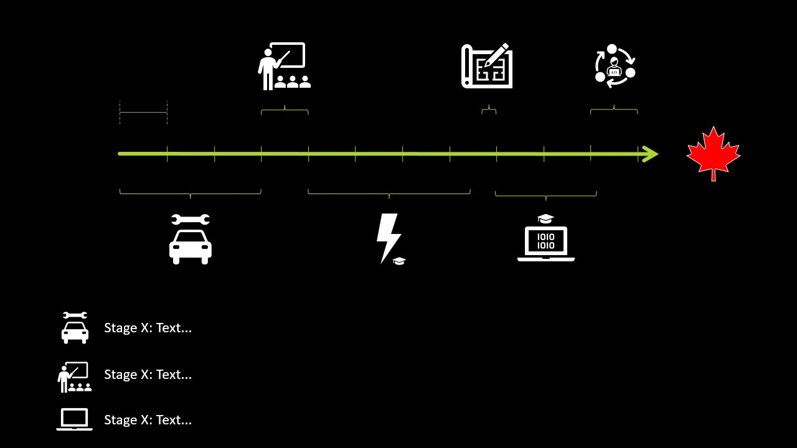
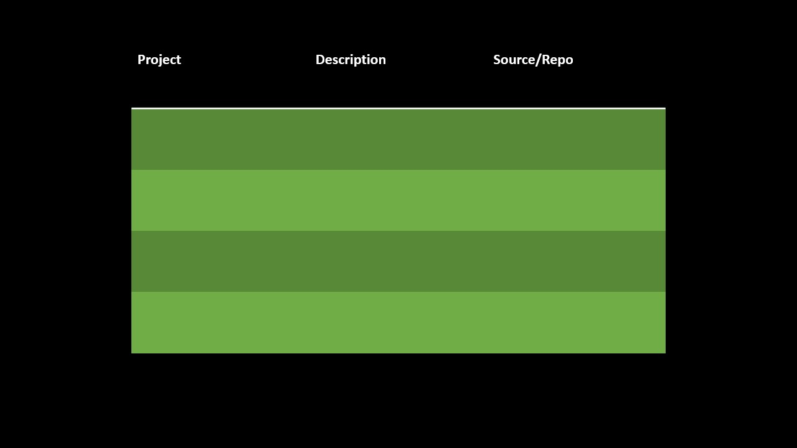

# Notes

My personal website.

** This website is currently under construction. Everything is written by myself and suits as a training in HTML, CSS and JavaScript. **

# Design Concept

## Start

My webpage's first page is a nearly nontransparent page (dark layer on top of main page). After a couple of seconds, the slogan: "Have you tried turning it off and on again?" and a clickable power button appear. After clicking the button, a simulated restart depicted by a loading bar is displayed. Reaching 100% will trigger the boot page. 

## Boot

The boot page shows a small boot sequence (black background with green text). After the boot sequence, the main page is reached.

## Main

The main page shows a picture of myself (clickable) and some small icons to other areas of the webpage. It is used as manu. In the footers are links to social media and repository

## Blog

Easy blog without many adds (KISS)

## Timeline + Personal Description

Timeline and personal description, which can be visited by clicking on my img

## Projects

Project page shows the projects, their status and a short summary.

